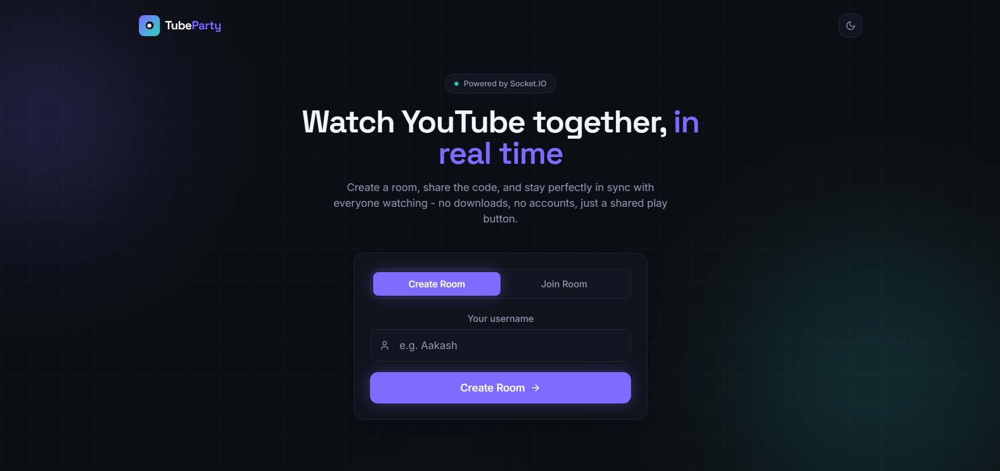
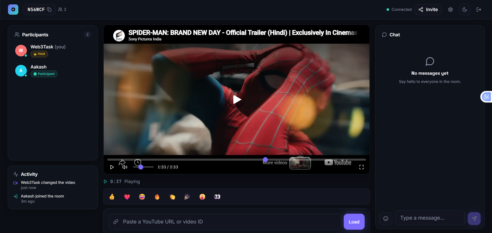
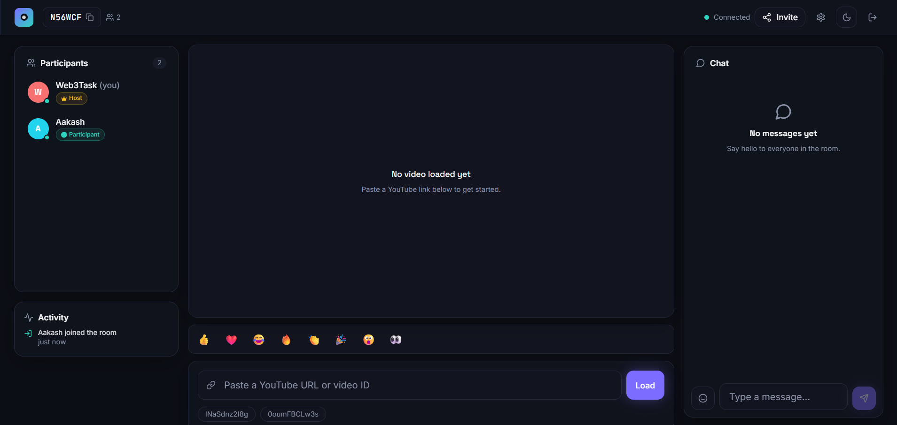
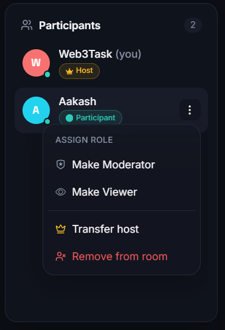
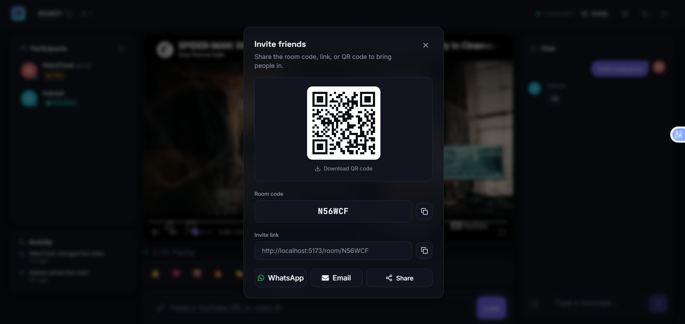
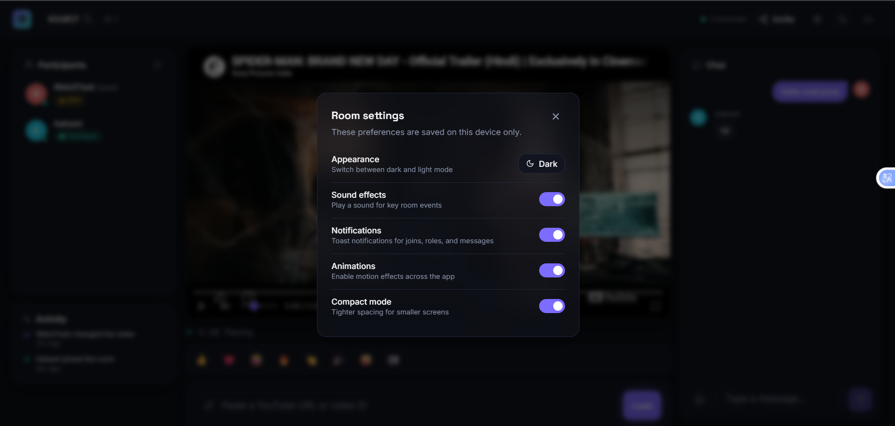

# TubeParty - Real-Time YouTube Watch Party

Watch YouTube videos together with friends, perfectly in sync. Create a room, share the code, and every play/pause/seek/video-change is broadcast to everyone in real time over Socket.IO.

**Live demo:** https://tube-party-phi.vercel.app

> A full synchronization/role-management audit was performed after this project's initial build - see the [Bug Fix Log](./ARCHITECTURE.md#bug-fix-log-synchronization--role-management-audit) in `ARCHITECTURE.md` for every issue found, its root cause, and how it was fixed (26 automated regression tests, all passing).

---

## Features

**Core (required by the assignment)**
- Create or join a room with just a username - no sign-up, no login
- Real-time sync of play, pause, seek, and video changes via Socket.IO
- Room-based model with shareable room codes and invite links
- Role-based access control: **Host, Moderator, Participant, Viewer**
- Host can assign roles, remove participants, and transfer host
- Backend validates every permission - the frontend hiding a button is UX only, never the actual security boundary

**Bonus / extra**
- Persistent rooms (room metadata survives a server restart via MongoDB)
- Text chat with typing indicators
- Emoji reactions that float over the player
- Live activity feed (joins, leaves, role changes, video changes, host transfers)
- OOP-based Socket.IO server architecture (`LiveRoom`, `Participant`, `RoomManager`, `PermissionManager`)
- Automatic host hand-off when the host disconnects
- Automatic cleanup of empty, inactive rooms
- QR code + WhatsApp/Email/native share for invites
- Recent rooms remembered locally, "remember my username"
- Dark/light theme with system-preference detection
- Fully responsive (mobile bottom nav, desktop 3-column layout)
- Reconnect banner + automatic Socket.IO reconnection

---

---

## 📸 Screenshots

### 🏠 Landing Page

Create a room or join an existing watch party with a clean and responsive interface.



---

### 🎬 Watch Party Room

The main synchronized viewing interface featuring the YouTube player, participants list, activity feed, reactions, and live chat.



---

### ▶️ Video Synchronization

Watch YouTube videos together in real time with synchronized playback controls across all connected participants.



---

### 👥 Role Management

The host can promote participants to moderators, transfer host privileges, or remove users from the room.



---

### 💬 Real-Time Chat

Built-in live chat powered by Socket.IO for instant communication during watch parties.

.png)

---

### 🔗 Invite Friends

Invite others instantly using the room code, shareable link, QR code, WhatsApp, Email, or the native Share API.



---

### ⚙️ User Preferences

Customize your experience with dark mode, notifications, animations, compact mode, and sound effects.



---

## Tech Stack

| Layer      | Technology                                                                 |
|------------|-----------------------------------------------------------------------------|
| Frontend   | React 19, Vite, Tailwind CSS, React Router, Framer Motion, Socket.IO Client |
| Backend    | Node.js, Express.js, Socket.IO                                              |
| Database   | MongoDB + Mongoose (room metadata persistence only)                        |
| Video      | YouTube IFrame Player API                                                  |
| Deployment | Vercel (frontend), Render (backend), MongoDB Atlas (database)              |

---

## Folder Structure

```
tubeparty/
├── server/                    # Express + Socket.IO backend
│   ├── config/                # DB connection
│   ├── constants/             # Roles, permissions, socket event names
│   ├── controllers/           # REST route handlers
│   ├── middleware/            # Rate limiting, error handling
│   ├── models/                # Mongoose schemas
│   ├── routes/                # Express routes
│   ├── socket/
│   │   ├── handlers/          # One file per event group (room/playback/moderation/chat)
│   │   ├── LiveRoom.js         # In-memory room state (OOP)
│   │   ├── Participant.js      # In-memory participant (OOP)
│   │   ├── RoomManager.js      # Singleton registry of active rooms
│   │   └── PermissionManager.js
│   ├── utils/                 # YouTube ID parsing, room code generation, logger
│   ├── validators/            # Input validation
│   └── server.js              # Entry point
│
├── client/                    # React + Vite frontend
│   └── src/
│       ├── components/        # ui/, common/, landing/, room/, player/, participants/, chat/, modals/
│       ├── context/           # ThemeContext, SocketContext, RoomContext
│       ├── hooks/              # useSocket, useLocalStorage, useClipboard, useShare, etc.
│       ├── pages/              # Landing, Room, NotFound, RoomNotFound
│       ├── services/           # REST API client, Socket.IO client wrapper
│       ├── constants/          # Roles, socket events, app constants
│       └── utils/              # YouTube parsing, formatting, classnames helper
│
├── render.yaml                # Render deployment blueprint
└── package.json                # Root scripts to run both apps together
```

---

## Getting Started

### Prerequisites
- Node.js 18+
- A MongoDB connection string (optional - the app runs fine without one, just without persistence across restarts). [MongoDB Atlas](https://www.mongodb.com/atlas) has a free tier.

### Installation

```bash
git clone <your-repo-url>
cd tubeparty
npm run install:all
```

### Environment Variables

Copy the example env files:

```bash
cp server/.env.example server/.env
cp client/.env.example client/.env
```

**server/.env**
```
PORT=5000
NODE_ENV=development
MONGO_URI=mongodb+srv://<user>:<password>@cluster0.mongodb.net/
CLIENT_URL=http://localhost:5173
ROOM_INACTIVITY_TIMEOUT_MINUTES=60
PARTICIPANT_RECONNECT_GRACE_MS=10000
```

**client/.env**
```
VITE_API_URL=http://localhost:5000/api
VITE_SOCKET_URL=http://localhost:5000
```

### Running Locally

From the project root, run both apps together:

```bash
npm run dev
```

This starts the server on `http://localhost:5000` and the client on `http://localhost:5173`.

Or run them separately:

```bash
npm run dev:server   # server only
npm run dev:client   # client only
```

### MongoDB Setup

1. Create a free cluster on [MongoDB Atlas](https://www.mongodb.com/atlas).
2. Create a database user and allow network access from your IP (or `0.0.0.0/0` for simplicity during development).
3. Copy the connection string into `server/.env` as `MONGO_URI`.

If `MONGO_URI` isn't set, the server logs a warning and runs anyway - all real-time features work purely in memory, you just lose room persistence across server restarts.

---

## Socket.IO Overview

A single Socket.IO connection is opened per browser tab (see `client/src/services/socket.js` and `SocketContext`). On the server, every connection gets the same set of handlers registered (`server/socket/index.js`), split by concern:

| File                    | Handles                                              |
|--------------------------|-------------------------------------------------------|
| `roomHandlers.js`         | `join_room`, `leave_room`, disconnect, host hand-off |
| `playbackHandlers.js`     | `play`, `pause`, `seek`, `change_video`              |
| `moderationHandlers.js`   | `assign_role`, `remove_participant`, `transfer_host` |
| `chatHandlers.js`         | `chat_message`, `typing`, `emoji_reaction`           |

### Event reference

| Event                  | Direction        | Payload                                   | Notes                                  |
|-------------------------|-------------------|---------------------------------------------|-----------------------------------------|
| `join_room`              | client → server  | `{ roomCode, username, participantId }`    | First joiner becomes Host. A `participantId` already in the room is treated as a **reconnect** (role restored), not a new join |
| `leave_room`             | client → server  | -                                            | Explicit, immediate removal - no grace period |
| `play` / `pause`         | client → server  | `{ currentTime }`                          | Host/Moderator only, backend-enforced  |
| `seek`                    | client → server  | `{ currentTime }`                          | Host/Moderator only                    |
| `change_video`            | client → server  | `{ videoUrlOrId }`                         | Host/Moderator only                    |
| `assign_role`             | client → server  | `{ targetParticipantId, role }`            | Host only                              |
| `remove_participant`      | client → server  | `{ targetParticipantId }`                  | Host only                              |
| `transfer_host`           | client → server  | `{ targetParticipantId }`                  | Host only; target must currently be online |
| `chat_message`            | client → server  | `{ text }`                                 |                                          |
| `typing`                  | client → server  | `{ isTyping }`                             |                                          |
| `emoji_reaction`          | client → server  | `{ emoji }`                                 |                                          |
| `sync_state`               | server → client  | full room snapshot, `currentVideo` time-extrapolated | Sent once, right after joining or reconnecting |
| `room_updated`             | server → room    | updated participant list                    | Silent presence sync (e.g. reconnect) - no toast |
| `user_joined` / `user_left` | server → room  | updated participant list + activity entry  | `user_left` fires once a departure is confirmed (grace period expired, or explicit leave) |
| `role_updated`             | server → room    | updated participant + activity entry       |                                          |
| `participant_removed`      | server → room    | updated list, or `youWereRemoved: true` to the removed user |                        |
| `host_changed`             | server → room    | new host + activity entry                  |                                          |
| `error_event`              | server → client  | `{ message }`                              | Sent when a permission or validation check fails |

---

## Role System

| Role         | Assigned by            | Can control playback | Can manage roles/participants |
|---------------|--------------------------|:---------------------:|:-------------------------------:|
| Host          | Automatic (room creator) | ✅                     | ✅                               |
| Moderator     | Host                      | ✅                     | ❌                               |
| Participant   | Default for joiners       | ❌                     | ❌                               |
| Viewer        | Host                      | ❌                     | ❌                               |

Every permission is re-checked on the server (`PermissionManager`) before any state mutation happens - hiding a button on the frontend is purely cosmetic and never trusted.

## Synchronization Flow

1. A user (Host or Moderator) presses play/pause, drags the scrub bar, or loads a new video.
2. The client emits `play` / `pause` / `seek` / `change_video` with the current player time.
3. The server validates the sender's role via `PermissionManager`, updates the room's in-memory `currentVideo` state, and broadcasts the update to everyone else in the room.
4. Every other client applies the update to its own YouTube player instance, tolerating small (<1.5s) drift before force-seeking, so minor network latency doesn't cause visible jitter.
5. A newly-joining client receives the full current state via `sync_state` immediately after joining, so they land in the same spot as everyone else.

Native YouTube scrub-bar drags are detected by polling `getCurrentTime()` once per second (for Host/Moderator only) and comparing it to the expected elapsed time - the IFrame API doesn't expose a dedicated "seek" event, so this is the simplest reliable way to catch it.

## Room Persistence & Cleanup

- **Hot state** (who's connected, current playback position, chat history, activity log) lives entirely in memory inside `RoomManager`, because it's only meaningful while sockets are connected and writing it to a database on every `play`/`pause` would add latency to the one feature that most needs to feel instant.
- **Cold state** (room code, host username, last known video/playback state, settings) is persisted to MongoDB so a room code keeps resolving even if the server restarts.
- A background interval (`server.js`) removes rooms that have been empty for longer than `ROOM_INACTIVITY_TIMEOUT_MINUTES`.

## Scalability Notes (not implemented, but designed for)

The `RoomManager` / `LiveRoom` split exists specifically so this can scale horizontally later without rewriting the socket handlers: move `RoomManager`'s in-memory `Map` into Redis, add the [Socket.IO Redis adapter](https://socket.io/docs/v4/redis-adapter/) so multiple server instances share room state and can broadcast across processes, and put a load balancer with sticky sessions in front. This wasn't implemented because the assignment's scale target (1,000 users / 100 rooms) doesn't require it, and adding Redis now would mean more moving parts to explain in a walkthrough without a real corresponding benefit at this scale.

---

## Deployment

### Frontend → Vercel
1. Import the repo into Vercel, set the root directory to `client`.
2. Framework preset: Vite.
3. Add environment variables `VITE_API_URL` and `VITE_SOCKET_URL` pointing at your deployed backend.
4. The included `client/vercel.json` handles SPA rewrites so refreshing `/room/ABC123` doesn't 404.

### Backend → Render
1. Create a new Web Service, root directory `server` (or use the included `render.yaml` blueprint).
2. Build command: `npm install`. Start command: `npm start`.
3. Add environment variables: `MONGO_URI`, `CLIENT_URL` (your Vercel URL), `NODE_ENV=production`.

### Database → MongoDB Atlas
See [MongoDB Setup](#mongodb-setup) above.

---

## Trade-offs Worth Knowing About (for the code walkthrough)

- **In-memory room state, not fully database-backed** - chosen for real-time speed; the durability trade-off is documented above.
- **Reconnection is identity-based via `participantId`, not a full session/token system** - there's still no authentication (by design, per the assignment), so identity is just a random id generated client-side and persisted in `localStorage` per room. This is enough to survive refreshes and brief disconnects cleanly, but it's not a security boundary: someone could technically fabricate another participant's id if they somehow obtained it. That's an accepted trade-off given there's no login system to anchor a "real" identity to in the first place.
- **The reconnect grace period is a fixed window (`PARTICIPANT_RECONNECT_GRACE_MS`, default 10s), not adaptive** - a refresh on a very slow connection that takes longer than this to reconnect will be treated as a real departure. 10s comfortably covers a normal refresh; it was chosen over a much longer window to keep "someone actually left" detection (host reassignment, room cleanup) reasonably responsive.
- **Client and server keep separate copies of shared constants** (role names, socket event names) rather than a shared package - simpler project setup at the cost of keeping two files in sync by hand.
- **Seek detection via polling, not a native event** - the YouTube IFrame API has no seek event, so this is the standard workaround.
- **Redis/horizontal scaling designed for, not implemented** - see [Scalability Notes](#scalability-notes-not-implemented-but-designed-for).

## Future Improvements

- Persist chat history to MongoDB (currently in-memory per room)
- Configurable moderator permissions (e.g., allow/disallow moderators from changing video)
- Picture-in-picture support
- Playback speed sync
- Room-level settings UI wired to backend (chat/reactions toggle is currently client-only)

## License

MIT
